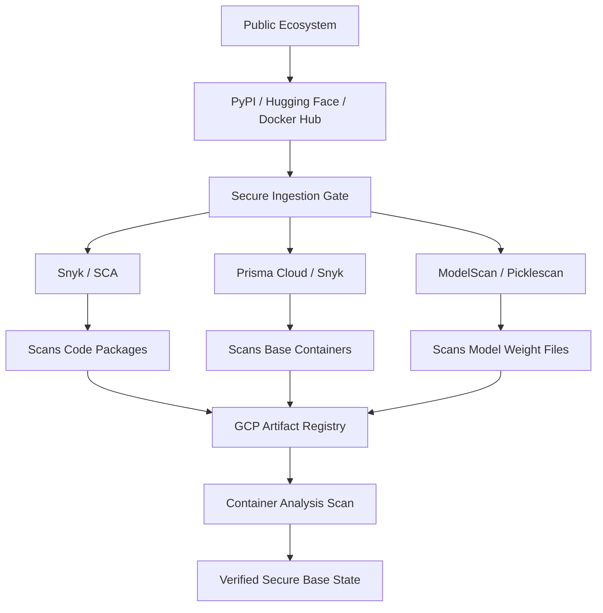
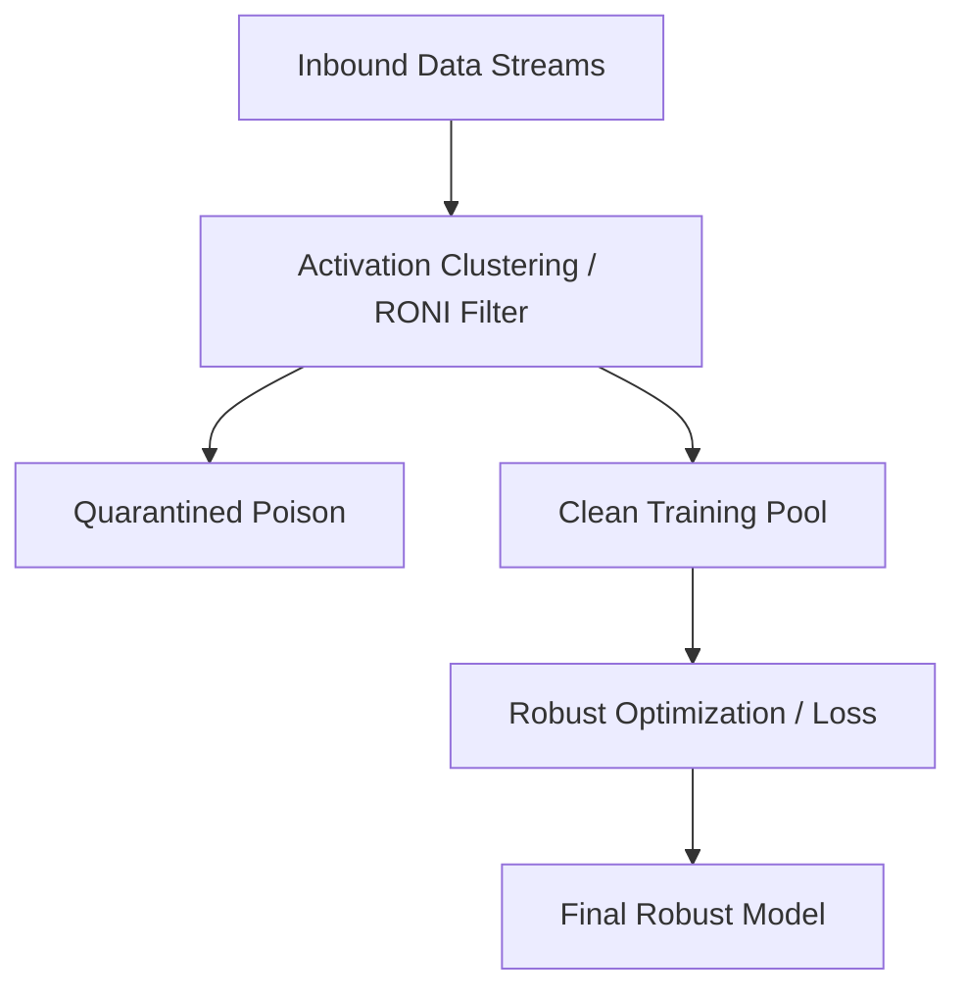
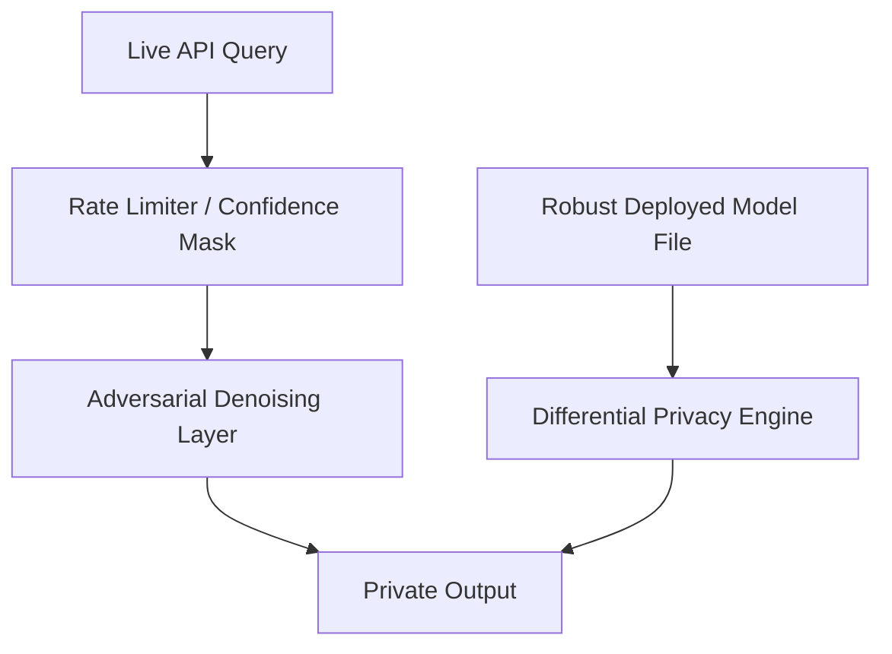

# Machine Learning Pipeline Threat Model & Security Blueprint

This document defines the core security posture, threat vectors, and mitigation controls for predictive Machine Learning pipelines. All MLOps engineering, data pipelines, and infrastructure deployments must comply with these architectural guardrails.

---

## 1. Phase 1: Software & Model Supply Chain Defense

This layer isolates, scans, and sanitizes all third-party code packages, base Docker container images, and pre-trained models before they enter development environments or automated pipelines.

### Threat Vector Map

- **Dependency Hijacking:** Typosquatting and dependency confusion on public package registries such as `PyPI`.
- **Exploited Deserialization:** Arbitrary system code execution via malicious serialized binaries such as `.pkl` or `.joblib`.
- **Infrastructure Compromise:** Outdated packages, vulnerabilities, or backdoors inside GPU/CUDA-optimized base Docker images.

### Secure Ingestion Gate Architecture

The Secure Ingestion Gate prevents unverified third-party assets from entering the ML development and deployment environment. All external packages, container images, and model artifacts are scanned before being promoted into GCP Artifact Registry.

Only assets that pass software composition analysis, container vulnerability scanning, and model artifact scanning are allowed to become part of the verified secure base state.

### Mandated Security Controls

1. **Software Composition Analysis (SCA):** Integrate **Snyk** into the CI/CD pipeline to parse `requirements.txt` files or lockfiles. Block any build containing dependencies with Critical or High CVEs.
2. **Container Scanning:** Route all notebook and pipeline base environments through **Prisma Cloud Compute** or **Snyk Container** to analyze base OS runtimes. Enable continuous background scanning using native **GCP Artifact Registry Container Analysis**.
3. **Model Binary Ingestion:** Integrate **ModelScan** or **Picklescan** into automated artifact pipelines. Every model artifact pulled from an external registry must be checked for embedded payload commands such as `os.system` or `subprocess` before loading.
4. **Format Constraints:** Enforce the exclusive usage of zero-code-execution serialization formats such as **safetensors** or **ONNX** for model storage and deployments.

---

## 2. Phase 2: Inbound Data & Training Phase Defense

This layer ensures that incoming data streams cannot manipulate, distort, or inject blind spots into the model's decision boundaries during training loops.

### Threat Vector Map

- **Outliers & Denial of Service:** Ingestion of highly corrupt features designed to break global performance.
- **Backdoors & Trojans:** Hidden trigger injections, such as pixel artifacts, designed to force targeted misclassifications during runtime while keeping baseline validation scores looking healthy.
- **Clean-Label Poisoning:** Subtly modifying legitimate training inputs to shift decision boundaries without triggering structural baseline errors.

### Phase 2 Defense Architecture

### Mandated Security Controls

1. **Reject on Negative Influence (RONI):** Before appending new data streams to primary training pools, train isolated proxy models on the new batches. Measure performance against a locked **Golden Baseline Dataset**. Automatically quarantine data if global error spikes occur.
2. **Activation Clustering:** Process incoming training datasets through feature extraction layers. Use dimensionality reduction to analyze neural layer activations. Isolate and delete dense, irregular sub-clusters within individual classes that may indicate backdoor triggers.
3. **Robust Statistics & Trimmed Optimization:** Replace standard Mean Squared Error or Cross-Entropy loss functions with robust alternatives such as Huber Loss. Configure optimization loops to automatically drop the top 2% to 5% of training samples yielding the highest individual loss values during an epoch.

---

## 3. Phase 3: Live Inference & Endpoint Privacy Defense

This layer shields deployed production models from external manipulation, extraction attacks, and user privacy breaches via live API queries.

### Threat Vector Map

- **Evasion Attacks:** Imperceptible adversarial perturbations applied to deployment queries to trick classification decisions.
- **Membership Inference:** Reverse-engineering high-precision prediction confidence margins to confirm whether a specific individual's record was used to train the dataset.
- **Model Theft / Extraction:** Submitting millions of structured queries to clone the target model's internal functionality for competitive replication.

### Live Inference Defense Architecture

### Mandated Security Controls

1. **Adversarial Training:** Incorporate the **Adversarial Robustness Toolbox (ART)** into final pipeline compilation blocks. Generate fast-gradient sign method (FGSM) perturbations against internal architectures, label them correctly, and mix them directly into the training loop to harden decision boundaries.
2. **Differentially Private SGD (DP-SGD):** Train sensitive final model layers using gradient clipping and calculated Gaussian noise injection via **TensorFlow Privacy** or **Opacus** to guarantee mathematical user privacy.
3. **API Output Abstraction:** Deployed API endpoints must never output raw floating-point prediction arrays. Intercept responses to round confidence outputs to coarse intervals or return only the hard `argmax` class label to disrupt reverse-engineering mathematics.

---

## 4. Operational Controls Summary Matrix

| Pipeline Phase | Target Risk / Threat Vector | Defensive Control | Operational Success Metric |
| :--- | :--- | :--- | :--- |
| **Supply Chain** | Package infiltration / typosquatting | **Snyk / Standard SCA** | 100% of open-source libraries checked against known CVE lists before compilation. |
| **Supply Chain** | Operating system / container exploits | **Prisma Cloud / Snyk Container** | Zero untrusted or root-vulnerable base images allowed into the Vertex AI sandbox. |
| **Supply Chain** | Pickled file serialized malware / backdoors | **ModelScan / Picklescan** | Blocks arbitrary operating system command executions hidden inside binary weights assets. |
| **Training Phase** | Inbound data poisoning / trojans | **RONI Filtering + Trimmed Loss** | Automated deletion or quarantine of suspicious training outliers and trigger anomalies. |
| **Inference Phase** | Evasion / model input manipulation | **Adversarial Training with ART** | Deployed endpoints remain robust when confronted with intentionally manipulated input files. |
| **Inference Phase** | Privacy breaches / inversion / membership inference | **DP-SGD + Output Masking** | Prevents competitors or malicious actors from reverse-engineering core baseline profiles via API data scraping. |

---

## 5. Additional ML Pipeline Security Coverage

The following sections add ML-specific threats and mitigations that are commonly missed when a threat model focuses only on ingestion, training robustness, and inference output privacy.

### 5.1 Dataset Lineage & Provenance Defense

#### Threat Vector Map

- **Untrusted Dataset Source:** Training data enters the pipeline from an unverified source, mirror, partner drop, or unlabeled storage path.
- **Dataset Version Confusion:** Training jobs accidentally use stale, poisoned, or unauthorized dataset snapshots.
- **Unauthorized Label Mutation:** Labels are modified after approval, shifting model behavior without a source code change.

#### Mandated Security Controls

1. **Dataset Provenance Tracking:** Every dataset must have a source, owner, collection date, license, approval status, and cryptographic checksum.
2. **Immutable Dataset Versioning:** Training, validation, test, and golden baseline datasets must be immutable once approved.
3. **Label Change Auditability:** Label edits must be logged with reviewer, timestamp, source record, old value, new value, and reason.
4. **Golden Dataset Protection:** Golden baseline datasets used for RONI and regression testing must be write-restricted and separately approved.

### 5.2 Feature Store & Training Data Access Defense

#### Threat Vector Map

- **Feature Store Poisoning:** Attackers alter derived feature values used by training or inference.
- **Training Data Leakage:** Sensitive values are exposed through notebook outputs, experiment tracking, logs, feature snapshots, or exported datasets.
- **Excessive MLOps Permissions:** Broad service account privileges allow unintended dataset writes or model deployment actions.

#### Mandated Security Controls

1. **Least-Privilege Feature Store Access:** Separate read, write, approve, and deploy permissions across MLOps roles and service accounts.
2. **PII and Secret Detection:** Scan datasets, feature tables, notebook outputs, and logs for secrets, direct identifiers, and regulated data.
3. **Feature Freshness and Integrity Checks:** Validate feature generation timestamps, source checksums, row counts, null rates, and distribution profiles.
4. **Training Job Identity Isolation:** Training jobs must run under dedicated service accounts with scoped access to only required datasets and artifact paths.

### 5.3 Model Registry & Deployment Integrity Defense

#### Threat Vector Map

- **Model Registry Tampering:** A model artifact is replaced, downgraded, or modified after validation.
- **Unauthorized Model Promotion:** A model is promoted to production without security approval, robustness checks, or privacy validation.
- **Rollback to Vulnerable Model:** A previously rejected or vulnerable model is redeployed during rollback.

#### Mandated Security Controls

1. **Signed Model Artifacts:** Every approved model artifact must have a checksum and signature before registry promotion.
2. **Promotion Gates:** Production deployment requires passing SCA, container scanning, model scanning, robustness tests, privacy checks, and approval workflow validation.
3. **Registry Immutability:** Approved model versions must be immutable. Corrections must create a new version rather than overwriting an existing artifact.
4. **Rollback Control:** Rollbacks may only target previously approved model versions that still pass current security policy.

### 5.4 CI/CD, Secrets, and Pipeline Orchestration Defense

#### Threat Vector Map

- **Pipeline Credential Theft:** CI/CD tokens, cloud keys, or registry credentials are exposed through logs, notebook commits, or environment variables.
- **Malicious Pipeline Step Injection:** A pipeline definition is altered to pull unapproved images, bypass scanning, or exfiltrate data.
- **Experiment Tracker Abuse:** Metadata systems leak dataset paths, model parameters, sensitive samples, or credentials.

#### Mandated Security Controls

1. **Secret Scanning:** Scan repositories, notebooks, pipeline YAML files, and logs for secrets before merge and deployment.
2. **OIDC-Based CI/CD Authentication:** Prefer short-lived workload identity tokens over long-lived static cloud keys.
3. **Pipeline Definition Review:** Changes to training, evaluation, deployment, and retraining pipeline definitions require code review and policy checks.
4. **Experiment Tracking Hygiene:** Prevent logging of raw samples, secrets, full prediction arrays, sensitive feature values, and private dataset paths.

### 5.5 Monitoring, Drift, and Retraining Loop Defense

#### Threat Vector Map

- **Silent Data Drift:** Production input distributions shift without alerting, weakening model behavior and increasing security risk.
- **Feedback Loop Poisoning:** Attackers manipulate production feedback that later becomes retraining data.
- **Monitoring Blind Spots:** Logs and metrics do not capture enough ML security telemetry to detect extraction, evasion, or poisoning attempts.

#### Mandated Security Controls

1. **Drift Monitoring:** Monitor feature distribution shifts, prediction distribution shifts, confidence changes, and class balance changes.
2. **Retraining Data Quarantine:** Production feedback must enter a quarantine zone before becoming eligible for retraining.
3. **Abuse Pattern Detection:** Monitor high-volume querying, low-variance query sweeps, confidence probing, boundary probing, and repeated near-duplicate inputs.
4. **Security Regression Testing:** Every retrained model must be tested against golden datasets, adversarial test suites, privacy checks, and prior production behavior.

